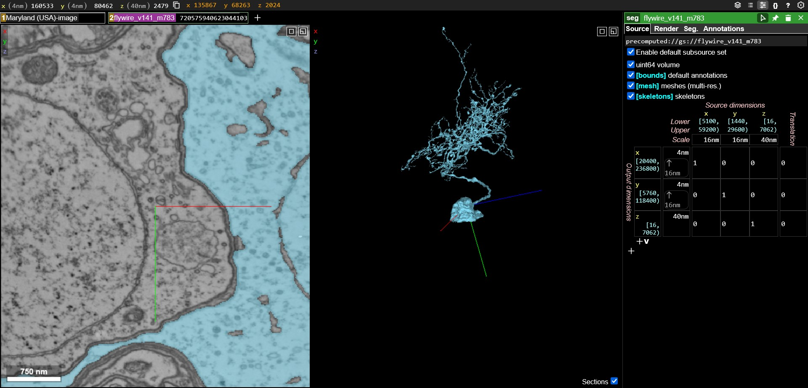

# 🪰 What is Flywire/Neuroglancer?

Neuroglancer (also abbreviated as *NGL*) is a web-based tool used to visualize 3D data, in our case being brain scans. [Flywire](https://ngl.flywire.ai/) is an online hosted version of Neuroglancer that is available to the general public; proofreaders generally make their edits using Flywire as it can synchronize global edits in one location. The Python integrations provide access to a **Neuroglancer environment separate from Flywire**. We recommend looking into Flywire as it has built-in tutorials (intended for human proofreaders) that may provide important context for developers.

***The Neuroglancer UI.***

The Neuroglancer UI provides two views to observe neuron data from. The **right window** provides a 3D environment that allows for panning, scrolling, translation, and other types of movement via keyboard or mouse. The **left window** provides a cross sectional image of your current layer height, which is defined by your 3D position (identifiable by the RGB axes on the right window).

To first get an intuitive understanding of the Neuroglancer UI, we recommend visiting [Flywire](https://ngl.flywire.ai) and following the basic tutorial provided; there is additional documentation on using [Flywire](https://ngl.flywire.ai) and the skill of proofreading there. For all intents and purposes it **functions exactly the same as the Neuroglancer environment** that can be initialized from the Python integrations, except for **some UI differences**.